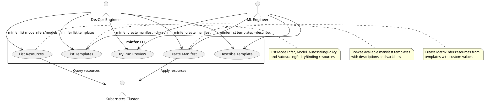
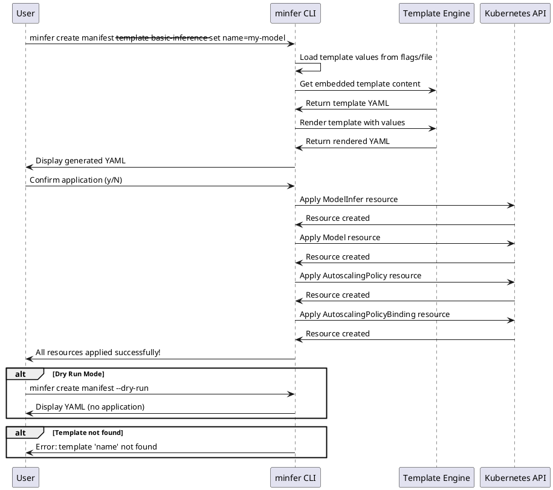
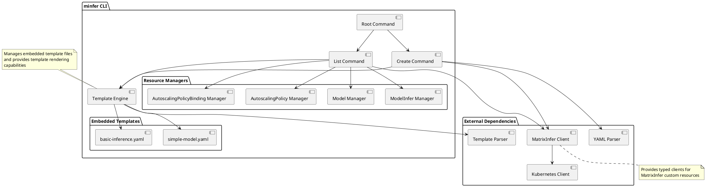

# minfer - MatrixInfer CLI

`minfer` is a command-line interface tool for managing MatrixInfer AI inference workloads in Kubernetes clusters.

## Architecture Diagrams

### Use Case Diagram



### Sequence Diagram - Create Manifest Flow



### Component Diagram



## Overview

The `minfer` CLI provides an easy way to:
- Create MatrixInfer resources from predefined manifest templates
- List and view existing MatrixInfer resources in your cluster
- Manage inference workloads, models, and autoscaling policies
- Apply configurations with template rendering and user confirmation

## Installation

### Prerequisites

- Go 1.24+ installed
- Kubernetes cluster with MatrixInfer CRDs installed
- kubectl configured to access your cluster
- Valid kubeconfig file

### Build from Source

```bash
# From the project root directory
make minfer
```

This will create a `minfer` binary in the `./bin` directory.

Alternatively, you can build manually:

```bash
# From the project root directory
go build -o bin/minfer cli/minfer/main.go
```

### Add to PATH (Optional)

```bash
# Add the bin directory to your PATH
export PATH=$PATH:$(pwd)/bin
```

## Usage

### Basic Commands

```bash
# Show help
minfer --help

# List available manifest templates
minfer list templates

# Show detailed information about a specific template
minfer list templates --describe basic-inference

# List MatrixInfer resources
minfer list modelinfers
minfer list models
minfer list autoscaling-policies
```

### Creating Resources from Manifests

The `minfer create manifest` command allows you to create MatrixInfer resources from predefined templates.

#### Basic Usage

```bash
# Create a basic inference workload
minfer create manifest \
  --template basic-inference \
  --set name=my-model \
  --set image=my-registry/model:v1.0 \
  --set model_name=my-model

# Use dry-run to preview without applying
minfer create manifest \
  --template basic-inference \
  --set name=my-model \
  --set image=nginx:latest \
  --set model_name=test-model \
  --dry-run

# Create from values file
minfer create manifest \
  --template basic-inference \
  --values-file values.yaml

# Specify target namespace
minfer create manifest \
  --template basic-inference \
  --namespace production \
  --set name=prod-model \
  --set image=my-registry/model:v2.0 \
  --set model_name=production-model
```

#### Using Values Files

Create a `values.yaml` file:

```yaml
name: my-inference-workload
image: my-registry/pytorch-model:v1.2.3
model_name: sentiment-analysis
model_version: v1.2.3
namespace: ml-workloads
replicas: 3
memory_request: 2Gi
cpu_request: 1000m
memory_limit: 4Gi
cpu_limit: 2000m
min_replicas: 1
max_replicas: 10
target_cpu: 80
framework: pytorch
author: ml-team
description: Sentiment analysis model for customer feedback
```

Then use it:

```bash
minfer create manifest --template basic-inference --values-file values.yaml
```

### Listing Resources

```bash
# List model inference workloads in current namespace
minfer list modelinfers

# List across all namespaces
minfer list modelinfers --all-namespaces

# List in specific namespace
minfer list models --namespace production

# List all resource types
minfer list models
minfer list autoscaling-policies
minfer list autoscaling-policy-bindings
```

## Available Manifest Templates

### basic-inference

Creates a complete inference setup with:
- ModelInfer workload
- Model registration
- AutoscalingPolicy
- AutoscalingPolicyBinding

**Required Variables:**
- `name`: Name for the inference workload
- `image`: Container image for the model server  
- `model_name`: Name of the model

**Optional Variables:**
- `namespace`: Target namespace (default: "default")
- `replicas`: Initial replica count (default: 1)
- `model_version`: Model version (default: "v1.0")
- `memory_request`, `cpu_request`: Resource requests
- `memory_limit`, `cpu_limit`: Resource limits
- `min_replicas`, `max_replicas`: Autoscaling bounds
- `target_cpu`: CPU utilization target for autoscaling
- `framework`: Model framework (default: "pytorch")

### simple-model  

Creates only a Model resource for model registration.

**Required Variables:**
- `model_name`: Name of the model
- `namespace`: Target namespace

**Optional Variables:**
- `model_version`: Model version (default: "v1.0")
- `framework`: Model framework (default: "pytorch")
- `description`: Model description
- `author`: Model author
- `tags`: Model tags

## Command Reference

### Global Flags

- `--help, -h`: Show help information

### `minfer create manifest`

Create resources from a manifest template.

**Flags:**
- `--template, -t`: Template name (required)
- `--values-file, -f`: YAML file with template values
- `--set`: Set individual template values (format: key=value)
- `--namespace, -n`: Target namespace (default: "default")
- `--dry-run`: Show rendered template without applying

**Examples:**
```bash
minfer create manifest --template basic-inference --set name=test,image=nginx,model_name=test
minfer create manifest --template simple-model --values-file model-values.yaml
minfer create manifest --template basic-inference --set name=test --dry-run
```

### `minfer list`

List MatrixInfer resources.

**Subcommands:**
- `modelinfers` (aliases: `mi`, `modelinfer`): List ModelInfer resources
- `models` (alias: `model`): List Model resources  
- `autoscaling-policies` (aliases: `asp`, `autoscaling-policy`): List AutoscalingPolicy resources
- `autoscaling-policy-bindings` (aliases: `aspb`, `autoscaling-policy-binding`): List AutoscalingPolicyBinding resources

**Flags:**
- `--namespace, -n`: Target namespace
- `--all-namespaces, -A`: List across all namespaces

**Examples:**
```bash
minfer list modelinfers
minfer list models --namespace production
minfer list autoscaling-policies --all-namespaces
```

### `minfer list templates`

List and describe available manifest templates.

**Flags:**
- `--describe`: Show detailed information about a specific manifest

**Examples:**
```bash
minfer list templates
minfer list templates --describe basic-inference
```

## Workflow Example

Here's a typical workflow for creating a new inference workload:

1. **List available manifests:**
   ```bash
   minfer list templates
   ```

2. **Examine a manifest template:**
   ```bash
   minfer list templates --describe basic-inference
   ```

3. **Create and preview resources:**
   ```bash
   minfer create manifest \
     --template basic-inference \
     --set name=sentiment-model \
     --set image=my-registry/sentiment:v1.0 \
     --set model_name=sentiment-analysis \
     --dry-run
   ```

4. **Apply to cluster:**
   ```bash
   minfer create manifest \
     --template basic-inference \
     --set name=sentiment-model \
     --set image=my-registry/sentiment:v1.0 \
     --set model_name=sentiment-analysis
   ```

5. **Verify deployment:**
   ```bash
   minfer list modelinfers
   minfer list models
   ```

## Configuration

The CLI uses your local kubectl configuration. Ensure you have:
- Valid kubeconfig file (usually `~/.kube/config`)
- Access to a Kubernetes cluster with MatrixInfer CRDs installed
- Appropriate RBAC permissions for the target namespaces

## Troubleshooting

### Common Issues

**Template not found:**
```bash
Error: template 'my-template' not found at templates/my-template.yaml
```
- Check available templates with `minfer list templates`
- Ensure you're in the correct directory with the `templates/` folder

**Kubeconfig issues:**
```bash
Error: failed to load kubeconfig
```
- Verify kubectl is configured: `kubectl cluster-info`
- Check kubeconfig file permissions and location

**Resource creation failures:**
```bash
Error: failed to apply ModelInfer my-model: resources not found
```
- Ensure MatrixInfer CRDs are installed in your cluster
- Verify you have permissions to create resources in the target namespace

### Debug Mode

Use `--dry-run` to preview generated YAML without applying:

```bash
minfer create manifest --template basic-inference --set name=debug --dry-run
```

## Contributing

To add new manifest templates:

1. Create a new `.yaml` file in the `templates/` directory
2. Use Go template syntax with variables: `{{.variable_name}}`
3. Add a description comment at the top: `# Description: Your template description`
4. Test with `minfer list templates --describe your-template`

Example template structure:
```yaml
# Description: Your template description
# Variables: var1, var2, var3
---
apiVersion: workload.matrixinfer.ai/v1alpha1
kind: ModelInfer
metadata:
  name: {{.name}}
  namespace: {{.namespace}}
spec:
  # ... template content
```