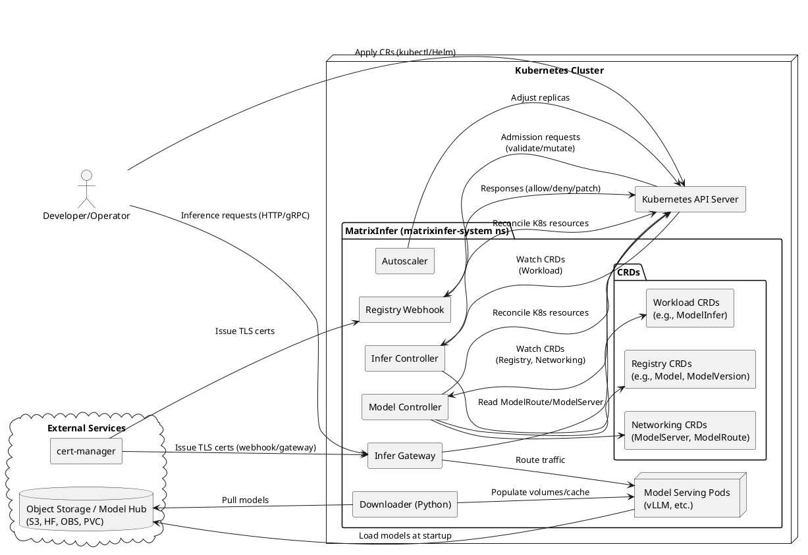

```plantuml
@startuml
' MatrixInfer Architecture Overview
' Date: 2025-08-21

skinparam componentStyle rectangle
skinparam shadowing false
left to right direction

actor "Developer/Operator" as User

node "Kubernetes Cluster" as K8s {
  component "Kubernetes API Server" as APIServer

  package "MatrixInfer (matrixinfer-system ns)" as MI {
    component "Model Controller" as ModelController
    component "Infer Controller" as InferController
    component "Registry Webhook" as RegistryWebhook
    component "Infer Gateway" as InferGateway
    component "Autoscaler" as Autoscaler
    component "Downloader (Python)" as Downloader

    package "CRDs" as CRDs {
      [Registry CRDs\n(e.g., Model, ModelVersion)] as RegistryCRDs
      [Workload CRDs\n(e.g., ModelInfer)] as WorkloadCRDs
      [Networking CRDs\n(ModelServer, ModelRoute)] as NetworkingCRDs
    }

    node "Model Serving Pods\n(vLLM, etc.)" as ModelPods
  }
}

cloud "External Services" as External {
  database "Object Storage / Model Hub\n(S3, HF, OBS, PVC)" as ObjectStore
  component "cert-manager" as CertManager
}

' Interactions
User --> APIServer : Apply CRs (kubectl/Helm)
APIServer --> RegistryWebhook : Admission requests\n(validate/mutate)
RegistryWebhook --> APIServer : Responses (allow/deny/patch)

APIServer --> ModelController : Watch CRDs\n(Registry, Networking)
APIServer --> InferController : Watch CRDs\n(Workload)
ModelController --> APIServer : Reconcile K8s resources
InferController --> APIServer : Reconcile K8s resources
Autoscaler --> APIServer : Adjust replicas

ModelController --> NetworkingCRDs
ModelController --> RegistryCRDs
InferController --> WorkloadCRDs

InferGateway --> APIServer : Read ModelRoute/ModelServer
User --> InferGateway : Inference requests (HTTP/gRPC)
InferGateway --> ModelPods : Route traffic

Downloader --> ObjectStore : Pull models
Downloader --> ModelPods : Populate volumes/cache
CertManager --> RegistryWebhook : Issue TLS certs
CertManager --> InferGateway : Issue TLS certs (webhook/gateway)

ObjectStore <-down- ModelPods : Load models at startup

@enduml
```