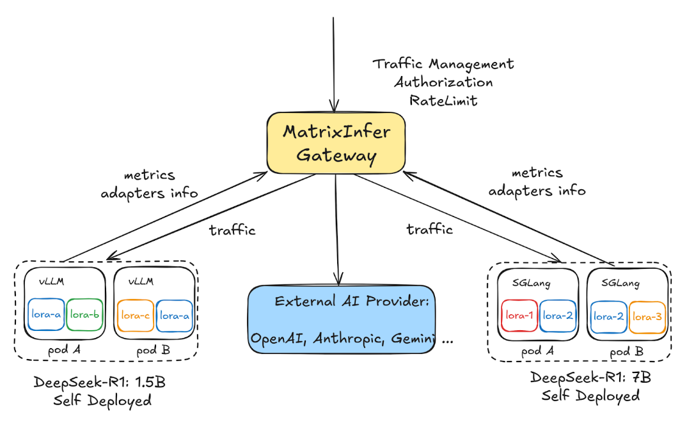
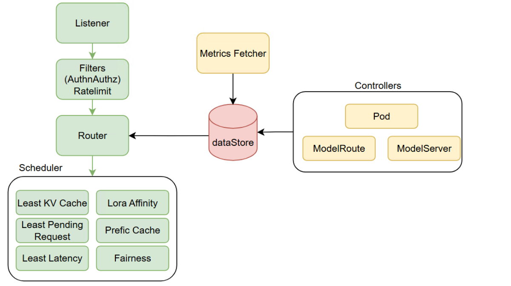

# Infer Gateway

MatrixInfer Gateway是一个独立的Gateway组件用于提供对LLM的统一访问。支持私有部署的LLMs以及Public AI Service Provider，例如OpenAI, DeepSeek, HuggingFace等。

我们的目标是提供一个轻量、用户友好以及可扩展的LLM Inference Gateway，能让用户在生产环境中快速构建和部署。有着最少的依赖，从而降低维护成本并且提高运行效率。

## Overview

MatrixInfer Gateway以独立二进制的形式部署，它既能与已有的Gateway Infrastructure协同工作，也能直接作为流量入口，单独处理AI流量。

对于后端模型的访问，既能访问外部的Public AI Service Provider，例如OpenAI，Google Gemini等，又能访问集群内部私有部署的模型。

尤其对于私有部署的模型，支持各类主流的推理框架，例如vLLM，SGLang等。通过持续地对Model所在Pod推理引擎的Metrics接口进行访问，实时获取模型的运行状态，包括当前加载的Lora信息，KVCache的使用量等指标。后续基于这些信息能够进行更为智能的路由决策。从而极大地提高推理服务的吞吐量并且降低时延。

## Core Components

Router：整体的执行框架，包括请求的接收、处理以及转发

Controller：对ModelRoute以及ModelServer等CR进行同步处理

Filters：包含Auth和RateLimit两个子模块，Auth负责对流量进行认证鉴权，RateLimit负责各种限流策略：input token，output token以及对不同用户层级的限流

Backend：对于各类推理引擎访问的抽象层，屏蔽不同推理引擎的Metrics接口的访问方式以及指标名称差异

Datastore：统一的数据存储层，能够简单地获取ModelServer与Pod的关联信息以及Pod内运行的Base Model/Lora以及运行时Metrics信息

Scheduler：实现流量调度算法，由调度框架和各类调度算法插件两部分组成，框架整合运行各种调度算法插件，对ModelServer对应的Pods集合进行筛选打分，选择出整体最优的Pod，最为最终的访问目标。

初期包含的调度插件包括：
    Least KV Cache Usage

    Least Latency：TPOT，TTFT

    Least Pending Request

    Prefix Cache Aware

    Lora Affinity

    Fairness Scheduling

## Features

独立的二进制（并非以Envoy等现有Proxy的插件形式），轻量，最小依赖，用户友好以及部署简单

无缝兼容现有的API Gateway基础设施，不管是基于Nginx, Envoy或者其他Proxy,最大限度的复用现有API网关的通用认证、鉴权等能力

Model Aware Routing，基于从推理引擎获取的metrics，从而更好地调度AI流量，提升推理性能

Lora Aware的负载均衡，感知Lora模型的动态加载和卸载

丰富的负载均衡算法：Session Affinity，Prefix Cache Aware，KV Cache Aware，Heterogeneous GPU Hardware Aware 提升推理服务的SLO，降低推理成本

推理引擎无关：兼容各类主流框架，例如vLLM，SGLang，TGI等

基于模型的金丝雀发布以及A/B测试

认证/鉴权，支持常用的API Key， JWT， Oauth Authorization

丰富的限流策略：input token，output token以及基于不同角色的限流

兼容上游Kubernetes社区的Gateway API的inference extension

## API

1. ModelRoute

ModelRoute用于定义流量的路由策略，基于请求特征：Model Name，Lora Name以及HTTP URL，Headers等相关信息，将流量转发至相应的ModelServer。

2. ModelServer

ModelServer用于定义推理服务实例以及流量访问策略，它通过WorkloadSelector圈定Model所在的Pod，在InferenceFramework指定部署模型使用的推理引擎，最后通过TrafficPolicy指定访问Model所在Pod的具体策略。
