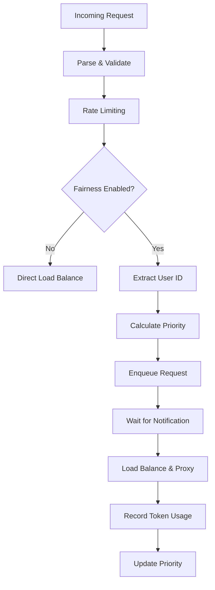

# Fairness Scheduling Design Proposal

## Overview

This document describes the design and implementation of the fairness scheduling system in Kthena's inference gateway. The system ensures equitable resource allocation among users by prioritizing requests based on historical token usage, preventing any single user from monopolizing inference resources.

## Background

In multi-tenant AI inference environments, different users may have varying request patterns and resource consumption. Without proper fairness mechanisms, heavy users can starve lighter users of resources, leading to poor user experience and unfair resource distribution. The fairness scheduling system addresses this by implementing a token-usage-based priority queue that ensures fair access to inference resources.

## Goals and Non-Goals

### Goals

1. **Fair Resource Allocation**
   - Prevent any single user from monopolizing inference resources
   - Ensure equitable access based on historical token usage patterns

2. **Multi-Tenant Support**
   - Support concurrent requests from multiple users with different usage patterns
   - Maintain fairness across different models and inference endpoints
   - Scale efficiently with increasing number of users and requests

### Non-Goals

1. **Cross-Gateway Coordination**
   - The initial implementation will not coordinate fairness state across multiple gateway instances
   - Each gateway maintains independent fairness state and scheduling decisions

2. **Persistent State Management**
   - Token usage history will not persist across gateway restarts
   - The system prioritizes performance over state durability for the initial version

3. **Advanced Queuing Algorithms**
   - Will not implement user priority based fairness
   - Focus on simple, effective token-usage-based priority scheduling

4. **Model-Specific Optimization**
   - Will not implement model-specific scheduling optimizations
   - The system treats all models uniformly for fairness calculations

5. **Guaranteed SLA Enforcement**
   - While improving fairness, the system will not guarantee specific latency SLAs
   - Performance depends on overall system capacity and load

6. **Adaptive QPS Control per Model Server**
   - This can be implemented in future

## Architecture

### Core Components

#### 1. Request Priority Queue

The queue implements a heap-based priority queue with the following characteristics:

- **Priority Logic**: Lower priority values indicate higher priority
- **Fairness Algorithm**: 
  - Same user requests: FIFO ordering based on `RequestTime`
  - Different users: Priority based on historical token usage
  - Equal priorities: FIFO based on arrival time

#### 2. Token Tracker

The `TokenTracker` maintains per-user, per-model token usage statistics:

- **Sliding Window**: Configurable time window for recent usage tracking
- **Weighted Tokens**: Configurable weights for input and output tokens
- **Memory Efficient**: Automatic pruning of expired buckets
- **Thread Safe**: Concurrent read/write operations supported

```go
type TokenTracker interface {
    GetTokenCount(user, model string) (float64, error)
    UpdateTokenCount(user, model string, inputTokens, outputTokens float64) error
}
```

#### 3. Router Integration

The router orchestrates fairness scheduling through:

- **Feature Flag**: `ENABLE_FAIRNESS_SCHEDULING` environment variable
- **Request Flow**: Authentication → Rate Limiting → Fairness Queue → Load Balancing
- **Token Recording**: Automatic token usage tracking after request completion

### Request Flow



## Implementation Details

### Priority Calculation

The fairness system uses historical token consumption as the priority metric:

1. **Token Weighting**: `priority = inputTokens × inputWeight + outputTokens × outputWeight`
   - Configurable weights to reflect different token costs
   - Input tokens typically have lower computational cost
   - Output tokens require generation and are more expensive
2. **Sliding Window**: Configurable time window for recent usage tracking
   - Balances responsiveness vs stability
   - Prevents indefinite penalty for past usage
3. **Per-Model Tracking**: Token usage is tracked separately for each model
4. **Lower Usage = Higher Priority**: Users with less recent usage get priority

### Queue Management

Each model maintains its own priority queue:

- **Per-Model Queues**: Separate queues prevent cross-model interference
- **Timeout Protection**: Configurable timeout prevents indefinite blocking
- **Automatic Cleanup**: Queues are cleaned up when models are deleted

### Memory Management

The token tracker implements efficient memory management:

- **Bucket Compaction**: Automatic compaction when >50% of buckets are expired
- **Cumulative Sums**: O(1) range queries using precomputed cumulative sums
- **Pruning Strategy**: Lazy pruning during read operations to minimize lock contention

## Configuration Design

### Design Principles

The fairness scheduling system should be configurable to adapt to different deployment scenarios without code changes:

1. **Parameterized Token Weighting**: Different token types should have configurable weights
2. **Adjustable Time Windows**: The historical tracking period should be tunable
3. **Scalable Processing**: Queue processing rates should match system capacity
4. **Environment-Driven**: Configuration through standard deployment mechanisms

### Configuration Parameters

#### Token Weight Configuration
- **Input Token Weight**: Multiplier for input tokens in priority calculation
  - Reflects the computational cost of processing input
  - Should be configurable per deployment based on model characteristics
- **Output Token Weight**: Multiplier for output tokens in priority calculation  
  - Typically higher than input weight due to generation cost
  - Should reflect the actual resource consumption ratio

#### Temporal Configuration
- **Sliding Window Duration**: Time period for token usage tracking
  - Shorter windows: More responsive to recent usage changes
  - Longer windows: More stable, less susceptible to burst patterns
  - Should be configurable based on usage patterns and fairness requirements

#### Performance Configuration
- **Queue Processing Rate**: Requests processed per second from fairness queues
  - Should match system capacity and latency requirements
  - Higher rates reduce queuing delay but increase CPU overhead
  - Should be tunable based on hardware and performance targets

### Configuration Interface Design

The system should support multiple configuration methods:

1. **Environment Variables**: For containerized deployments
2. **Configuration Files**: For complex multi-parameter setups  
3. **Runtime APIs**: For dynamic adjustment without restarts
4. **Programmatic Options**: For embedded usage scenarios

### Configuration Scenarios

Different deployment scenarios require different configuration approaches:

#### High-Throughput Scenarios
- **Characteristics**: Many concurrent users, burst traffic patterns
- **Configuration Needs**:
  - Higher queue processing rates to minimize latency
  - Shorter sliding windows for quick adaptation to usage changes
  - Balanced token weights reflecting actual resource costs

#### Cost-Sensitive Deployments  
- **Characteristics**: Expensive inference operations, budget constraints
- **Configuration Needs**:
  - Higher output token weights to reflect generation costs
  - Longer sliding windows for stable cost distribution
  - Conservative queue processing to manage resource usage

#### Multi-Tenant Platforms
- **Characteristics**: Diverse user bases, varying usage patterns
- **Configuration Needs**:
  - Configurable per-tenant or per-model parameters
  - Medium sliding windows balancing fairness and responsiveness
  - Adaptive processing rates based on system load

#### Development/Testing Environments
- **Characteristics**: Irregular usage, debugging needs
- **Configuration Needs**:
  - Equal token weights for simplified testing
  - Short sliding windows for quick feedback
  - Lower processing rates to reduce resource consumption

## Operational Characteristics

### Performance

- **Queue Operations**: O(log n) enqueue/dequeue operations
- **Token Lookup**: O(1) amortized, O(B) worst case (B = buckets per user)
- **Memory Usage**: O(U × M × B) where U=users, M=models, B=buckets per window
- **Concurrency**: Read-optimized with minimal write lock contention

### Scalability

- **Horizontal**: Each gateway instance maintains independent state
- **Vertical**: Memory usage scales linearly with active users and models
- **Cleanup**: Automatic pruning prevents unbounded memory growth

### Monitoring

The system provides queue statistics for observability:

```go
type QueueStat struct {
    Model  string
    Length int
}
```

## Trade-offs and Limitations

### Advantages

1. **True Fairness**: Prevents resource monopolization by heavy users
2. **Model Isolation**: Per-model queues prevent cross-model interference
3. **Adaptive**: Priority adjusts dynamically based on recent usage
4. **Efficient**: Minimal overhead for normal operations

### Limitations

1. **Memory Overhead**: Requires tracking per-user, per-model statistics
2. **Cold Start**: New users may experience slight delays during queue processing
3. **State Loss**: Gateway restarts reset token usage history
4. **Single Instance**: No cross-gateway coordination of fairness state

### Design Decisions

1. **In-Memory Storage**: Chosen for performance over persistence
2. **Sliding Window**: Balances fairness responsiveness with stability
3. **Token Weighting**: Output tokens weighted higher due to generation cost
4. **Per-Model Queues**: Prevents model interference at cost of complexity

## Future Enhancements

### Short Term

1. **Persistent Storage**: Redis-based token tracking for state persistence
2. **Metrics Integration**: Prometheus metrics for queue lengths and wait times
3. **Configuration API**: Runtime configuration updates without restarts

### Long Term

1. **Cross-Gateway Coordination**: Distributed fairness across multiple instances
2. **Advanced Algorithms**: Weighted fair queuing or deficit round-robin
3. **User Classes**: Different fairness policies for different user tiers
4. **Predictive Scheduling**: ML-based request arrival prediction

## Testing Strategy

### Unit Tests

- Token tracker sliding window behavior
- Priority queue ordering correctness
- Concurrent access safety
- Memory leak prevention

### Integration Tests

- End-to-end fairness behavior
- Queue timeout handling
- Model deletion cleanup
- Performance under load

### Load Tests

- High concurrency scenarios
- Memory usage patterns
- Queue processing latency
- Fairness distribution analysis

## Design Rationale

### Why Configurable Parameters?

The fairness scheduling system must adapt to diverse deployment scenarios without requiring code modifications:

#### Operational Flexibility
- **Deployment Variations**: Different environments have different resource constraints and performance requirements
- **Cost Models**: Token costs vary significantly across different models and providers
- **Usage Patterns**: User behavior and traffic patterns differ between applications
- **Hardware Constraints**: Available compute resources affect optimal processing rates

#### Maintainability Benefits
- **Single Codebase**: One implementation serves multiple deployment scenarios
- **Reduced Complexity**: Configuration changes don't require code updates or redeployment
- **Testing Simplification**: Different configurations can be tested without code branches
- **Operational Safety**: Configuration errors are recoverable without code rollbacks

#### Scalability Considerations
- **Growth Adaptation**: Parameters can be adjusted as system load and user base grow
- **Resource Optimization**: Fine-tuning based on actual resource consumption patterns
- **Performance Tuning**: Adjustment based on observed latency and throughput metrics
- **Cost Management**: Dynamic adjustment based on operational cost analysis

### Configuration Validation Strategy

The system should implement robust validation to prevent misconfigurations:

1. **Range Validation**: Ensure parameters fall within acceptable bounds
2. **Consistency Checks**: Verify parameter combinations make sense
3. **Fallback Mechanisms**: Use safe defaults when invalid configurations are detected
4. **Runtime Monitoring**: Track configuration effectiveness and suggest optimizations

## Conclusion

The fairness scheduling system provides a robust foundation for equitable resource allocation in multi-tenant AI inference environments. By designing with configurable parameters from the ground up, the system can adapt to diverse deployment scenarios, cost models, and performance requirements without code modifications. The token-usage-based priority system ensures fair access to inference resources while maintaining operational flexibility and maintainability. This design approach enables the system to evolve with changing requirements and scale across different environments while preserving fairness guarantees.