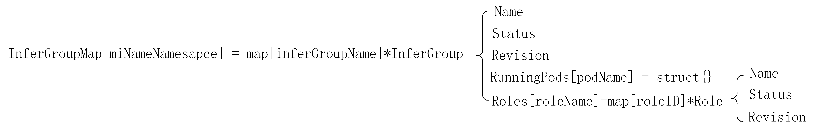

# Proposal: ModelInfer Support Role Scaling

## Goals

- **Support Role Scaling**: Allows users to dynamically control the number of role replicas through the `role.replicas` field.

## 1. Introduction

With the rapid development of large model inference technology, Disaggregated Prefilling inference has gradually become a common architectural pattern. 
In this architecture, P instances handle the model's Prefill stage, while D instances handle the model's Decode stage. Disaggregated Prefilling deployment can enhance system throughput in large-scale inference scenarios. 

However, in practical applications, the number of P and D instances might change because of varying demands. To handle these changes in workload, it's really important to be able to adjust the number of P and D instances.
By dynamically adjusting instance counts, we can improve resource utilization while maintaining optimal system performance even under heavy loads.

## 2. Current Architecture Analysis

Currently, ModelInfer only supports scaling at the **inferGroup** level. Any adjustments to the number of Roles by users are treated as rolling upgrades, requiring the existing 
inferGroup to be deleted and rebuilt. This process inevitably leads to service interruptions or resource wastage. Therefore, enabling role-level scaling is critical—the goal is 
to dynamically adjust the numbers of P and D instances without rebuilding inferGroup instances, thereby enhancing system flexibility and resource utilization efficiency.

## 3. Implemented Architecture

### 3.1 Core Design Principles

**Improve Global Storage**: Add the role list corresponding to inferGroup in the global storage

**Role Replicas Management**: Maintain the expected number of replicas for each role  

**Optimize Pod Deletion Processing**: Distinguish between voluntary pod deletion and involuntary pod deletion due to failures

### 3.2 Improve Global Storage

In global storage, role-related information (including roleName, roleStatus, etc.) should be incorporated into the inferGroup configuration, which will serve as a reference for role scaling operations.

```go
type InferGroup struct {
    Name        string
    runningPods map[string]struct{} // Map of pod names in this infer group
    Revision    string
    Status      InferGroupStatus
    roles       map[string]map[string]*Role // roleName -> roleID -> *Role, like prefill -> prefill-0 -> *Role
}

type Role struct {
    Name     string
    Revision string
    Status   RoleStatus
}
```



### 3.3 Role Replicas Management

#### 3.3.1 Core flow chart


#### 3.3.2 Reconcile Processing Workflow

1. InferGroup scaling
   In ModelInfer reconcile process, firstly perform inferGroup scaling (this part has been implemented)
2. Scheduling configuration updates
   ModelInfer controller calculates required fields for gang scheduling (e.g., minResource, minTaskMember) based on the latest configured role replica count, then executes podGroup update to refresh scheduling requirements.
3. InferGroup State Validation & Replica Adjustment
   - ModelInfer Controller get the inferGroup list from global storage and checks each inferGroup's status. Only inferGroups with a status other than **deleting** undergo role replica verification (those in deletion state are skipped and automatically rebuilt after removal).
   - ModelInfer controller then fetches the role list within each inferGroup from global storage, performing creation/deletion operations based on desired replica counts to maintain alignment with expectations. During the scaling process, the inferGroup state will be set to **scaling**
4. InferGroup Rolling Upgrade Process.
   modifications to `role.replicas` or `inferGroup.replicas` do not trigger rolling upgrades

### 3.4 Optimize Pod Deletion Processing


Pod Controller monitors all pod creation, deletion, and update events related to ModelInfer. Upon detecting a pod deletion event, it performs different handling based on whether the deletion was initiated by the controller:

1. Controller-Initiated Deletion Handling

- inferGroup or role status of the deleted pod is **deleting**. it indicates a controller-triggered deletion. Pod Controller only needs to verify whether the deletion process is complete. 
  If so, it triggers storage updates and reconcile (this primarily occurs during controller-initiated scaling down or rolling updates of inferGroup/role)

2. Failure Deletion Handling

- If neither the inferGroup nor role status is "deleting", the pod deletion was caused by a failure. In this case, Pod Controller will process according to the RecoveryPolicy:
  If set to **RoleRestart**, triggers role-level deletion and recreation, only the failed role instance will be rebuilt; If set to **InferGroupRestart**, triggers full inferGroup deletion and recreation.

## 4. Expected Results

```yaml
apiVersion: workload.volcano.sh/v1alpha1
kind: ModelInfer
metadata:
  name: sample
  namespace: default
spec:
  schedulerName: volcano
  replicas: 1 
  template:
    restartGracePeriodSeconds: 60
    roles:
      - name: prefill
        replicas: 1       # This field enables dynamic control of replica counts for each role.
        entryTemplate:
          spec:
            containers:
              - name: leader
                image: nginx
                ports:
                  - containerPort: 8080
```

## 5. Conclusion

This feature allows users to dynamically adjust the replica count of a role via `role.replicas` field, making it ideal for dynamically scaling the proportion of P D instances during large-scale model inference.